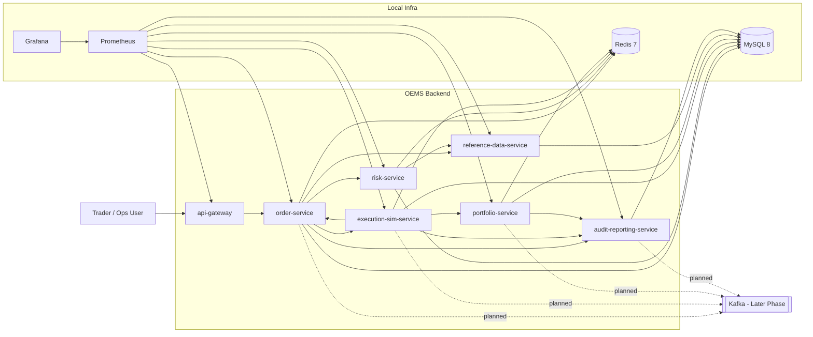

# OEMS Architecture Diagram

```mermaid
flowchart LR
    Trader[Trader / Ops User]

    subgraph OEMS[OEMS Backend]
        AGW[api-gateway]
        ORD[order-service]
        RSK[risk-service]
        EXE[execution-sim-service]
        PRT[portfolio-service]
        REF[reference-data-service]
        AUD[audit-reporting-service]
    end

    subgraph Infra[Local Infra]
        MYSQL[(MySQL 8)]
        REDIS[(Redis 7)]
        PROM[Prometheus]
        GRAF[Grafana]
    end

    Trader --> AGW
    AGW --> ORD

    ORD --> REF
    ORD --> RSK
    ORD --> EXE
    EXE --> ORD
    EXE --> PRT

    RSK --> REF
    ORD --> AUD
    EXE --> AUD
    PRT --> AUD

    ORD --> MYSQL
    RSK --> MYSQL
    EXE --> MYSQL
    PRT --> MYSQL
    REF --> MYSQL
    AUD --> MYSQL

    ORD --> REDIS
    RSK --> REDIS
    EXE --> REDIS
    PRT --> REDIS

    PROM --> AGW
    PROM --> ORD
    PROM --> RSK
    PROM --> EXE
    PROM --> PRT
    PROM --> REF
    PROM --> AUD
    GRAF --> PROM

    KAFKA[[Kafka - Later Phase]]
    ORD -. planned .-> KAFKA
    EXE -. planned .-> KAFKA
    PRT -. planned .-> KAFKA
    AUD -. planned .-> KAFKA
```
