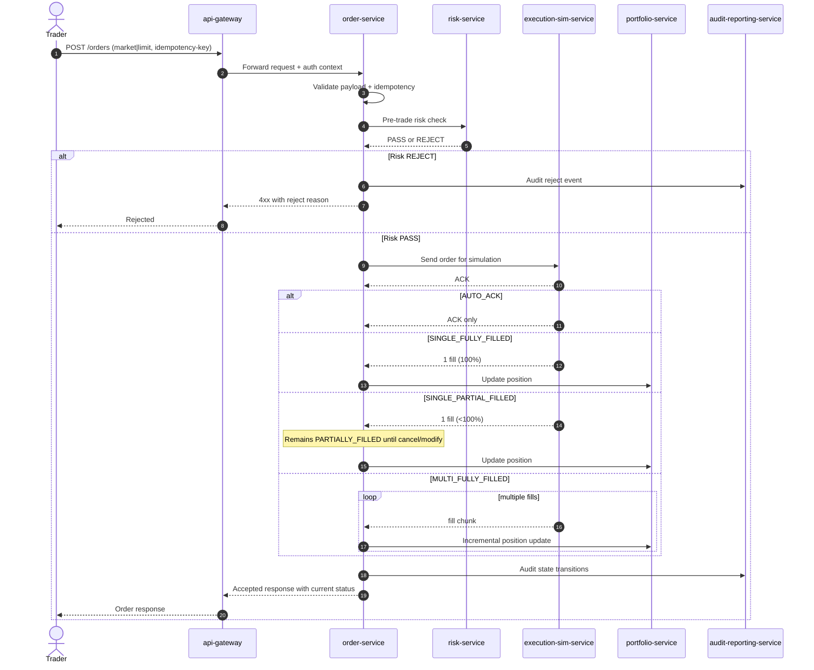

# OEMS Order Flow (Market/Limit)

```mermaid
sequenceDiagram
    autonumber
    actor U as Trader
    participant G as api-gateway
    participant O as order-service
    participant R as risk-service
    participant X as execution-sim-service
    participant P as portfolio-service
    participant A as audit-reporting-service

    U->>G: POST /orders (market|limit, idempotency-key)
    G->>O: Forward request + auth context
    O->>O: Validate payload + idempotency
    O->>R: Pre-trade risk check
    R-->>O: PASS or REJECT

    alt Risk REJECT
        O->>A: Audit reject event
        O-->>G: 4xx with reject reason
        G-->>U: Rejected
    else Risk PASS
        O->>X: Send order for simulation
        X-->>O: ACK

        alt AUTO_ACK
            X-->>O: ACK only
        else SINGLE_FULLY_FILLED
            X-->>O: 1 fill (100%)
            O->>P: Update position
        else SINGLE_PARTIAL_FILLED
            X-->>O: 1 fill (<100%)
            Note over O: Remains PARTIALLY_FILLED until cancel/modify
            O->>P: Update position
        else MULTI_FULLY_FILLED
            loop multiple fills
                X-->>O: fill chunk
                O->>P: Incremental position update
            end
        end

        O->>A: Audit state transitions
        O-->>G: Accepted response with current status
        G-->>U: Order response
    end
```
